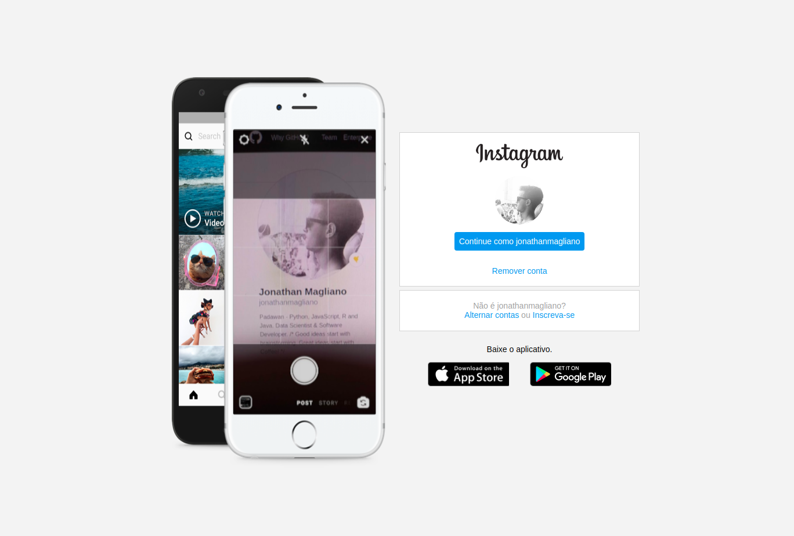

# Simulação de uma página de login do Instagram:
Nesse projeto foi utilizado conceitos sobre CSS Flexbox e responsividade. Desafio proposto pelo bootcamp Everis.

### Material de apoio:

* [HTML](https://www.w3schools.com/html/)
* [CSS](https://developer.mozilla.org/pt-BR/docs/Web/CSS)
